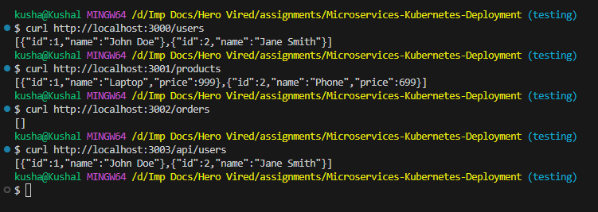
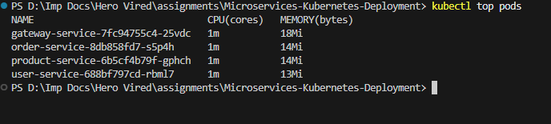
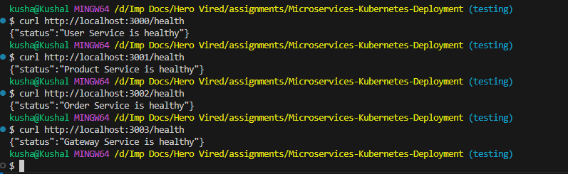
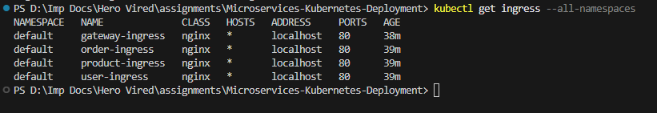
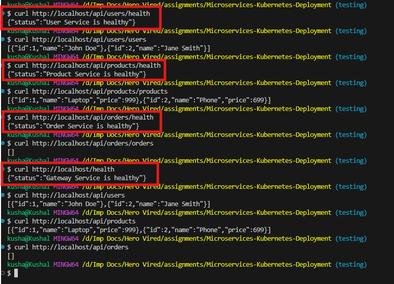

# Microservices Kubernetes Deployment

This project showcases deploying a Node.js microservices-based architecture on Kubernetes using Docker Desktop’s built-in cluster. It consists of four independent services communicating internally and accessed externally through Ingress.

## Project Overview

Microservices included:

- User Service (Port 3000)
- Product Service (Port 3001)
- Order Service (Port 3002)
- Gateway Service (Port 3003)

Each service exposes REST APIs. The Gateway acts as an entry point routing external requests to appropriate internal services.

## Tools and Commands Used
- Docker Desktop (Kubernetes enabled)
- kubectl (apply, describe, logs, top)
- curl (API testing)
- GitHub version tagging (v1.0, v2.0, v3.0)
---

## Versioning Strategy

This project is implemented incrementally with Git tags:

- `v1.0`: Deployments and Services with basic configuration
- `v2.0`: Added resource requests/limits and liveness/readiness probes
- `v3.0`: Configured Ingress routing with modular Ingress resources per service

---

## `v1.0` – Basic Deployments and ClusterIP Services

- Created Deployment and Service YAML files for all services.
- Each service was exposed internally using `type: ClusterIP`.
- Local testing was performed using `kubectl port-forward`.

### Core Manifests:
- `user-service.yaml`
- `product-service.yaml`
- `order-service.yaml`
- `gateway-service.yaml`

### Commands Used:
```bash
kubectl apply -f user-service.yaml
kubectl apply -f product-service.yaml
kubectl apply -f order-service.yaml
kubectl apply -f gateway-service.yaml

kubectl port-forward svc/user-service 3000:3000
curl http://localhost:3000/users
```

### Screenshots and Terminal Outputs:

- *Screenshot: Port Forwarding*
<p align="center">
  
</p>

<br>

- *Screenshot: API testing with `curl`*
<p align="center">
  
</p>

<br>

---

## `v2.0` – Resource Limits and Health Probes

- Defined `resources.requests` and `resources.limits` in all Deployments.
- Added `livenessProbe` and `readinessProbe` based on either `/health` endpoints or standard data routes.
- Verified using `kubectl top pods` and described pod details.

### Sample Resource Block:
```
resources:
  requests:
    cpu: "100m"
    memory: "128Mi"
  limits:
    cpu: "250m"
    memory: "256Mi"

```
### Sample Probe Block:
```
livenessProbe:
  httpGet:
    path: /health
    port: 3000
  initialDelaySeconds: 10
  periodSeconds: 10

```

### Screenshots and Terminal Outputs:

- *Screenshot: Pods Memory check*
<p align="center">
  
</p>

<br>

> **Note**: For instructions on setting up the metrics server in Docker Desktop Kubernetes, see the guide: [Metrics Server Setup](./metrics-server-setup.md)


<br>

- *Screenshot: API health testing with `curl`*
<p align="center">
  
</p>

<br>

---

## `v3.0` – Ingress Configuration
- Enabled Ingress on Docker Desktop
- Created separate `Ingress` YAML files for each service:
   - `user-ingress.yaml`
   - `product-ingress.yaml`
   - `order-ingress.yaml`
   - `gateway-ingress.yaml`
- Configured `pathType: Prefix` routes
- Used `/api/<entity>` and `/` routes via `localhost`

### Sample Ingress Path:
```
- path: /api/users
  pathType: Prefix
  backend:
    service:
      name: user-service
      port:
        number: 3000
```

### Routing Table:
| Path            | Service         |
| --------------- | --------------- |
| `/api/users`    | user-service    |
| `/api/products` | product-service |
| `/api/orders`   | order-service   |
| `/`             | gateway-service |

### Commands Used:
- Apply ingress manifests
```bash
kubectl apply -f user-ingress.yaml
kubectl apply -f product-ingress.yaml
kubectl apply -f order-ingress.yaml
kubectl apply -f gateway-ingress.yaml
```
- List all Ingress resources
```
kubectl get ingress --all-namespaces
```
- Port Forwarding 
```
kubectl port-forward -n ingress-nginx svc/ingress-nginx-controller 80:80
```
- Check health status of each service

```
curl http://localhost/api/users/health
curl http://localhost/api/products/health
curl http://localhost/api/orders/health
curl http://localhost/health
```

### Screenshots and Terminal Outputs:


- *Screenshot: Ingress Namespaces*
<p align="center">
  
</p>

<br>

- *Screenshot: API testing with `curl`*
<p align="center">
  
</p>

<br>

---

## Difficulties Faced:

| Problem   | Solution |
| --------- | -------- |
| **ClusterIP not accessible from local machine**                                | Used `kubectl port-forward` for each service in `v1.0` to enable testing from localhost.                                                    |
| **Health probes failing initially**                                            | Realized that probes were pointing to `/` instead of valid endpoints like `/health` or `/users`. Added `/health` endpoints in each service. |
| **Ingress `pathType: Prefix` warning with regex-style paths**                  | Removed unsupported regex grouping from `/()(.*)` path and replaced it with a clean `/` root path.                                          |
| **Multiple routes in a single Ingress file became verbose and hard to manage** | Split the Ingress definition into multiple modular files, one per service (`user-ingress.yaml`, etc.)                                       |
| **Verifying resource usage visually**                                          | Used `kubectl top pods` and `kubectl describe pod <name>` to confirm applied limits and requests.                                           |
| **Ingress curl tests initially returning 404**                                 | Ensured Ingress Controller was enabled in Docker Desktop, paths were correctly defined, and DNS fallback to `localhost` was used.           |

---

## References & Resources

- [Kubernetes Documentation – Deployments](https://kubernetes.io/docs/concepts/workloads/controllers/deployment/)
- [Kubernetes Documentation – Services](https://kubernetes.io/docs/concepts/services-networking/service/)
- [Kubernetes Documentation – Probes](https://kubernetes.io/docs/tasks/configure-pod-container/configure-liveness-readiness-startup-probes/)
- [Kubernetes Documentation – Ingress](https://kubernetes.io/docs/concepts/services-networking/ingress/)
- [Metrics Server Setup Guide (Official)](https://github.com/kubernetes-sigs/metrics-server)
- [Docker Desktop Kubernetes Setup](https://docs.docker.com/desktop/kubernetes/)
- [Node.js Docker Best Practices](https://nodejs.org/en/docs/guides/nodejs-docker-webapp/)
- [kubectl Cheat Sheet](https://kubernetes.io/docs/reference/kubectl/cheatsheet/)

